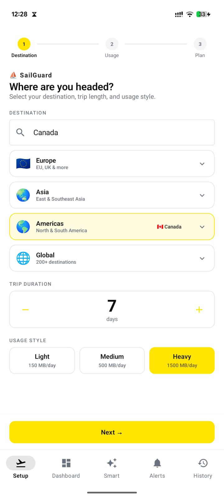
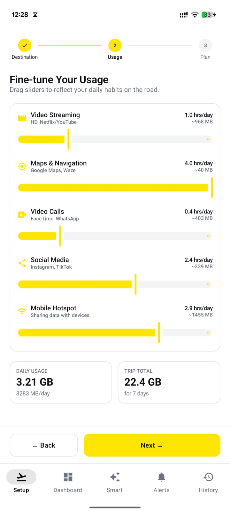
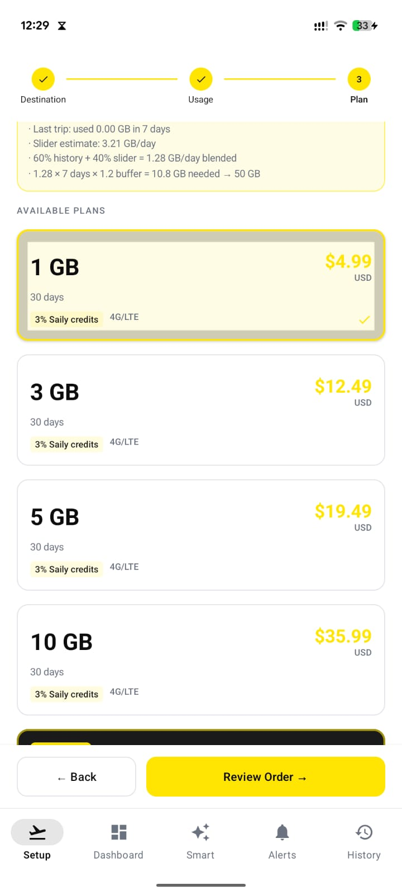
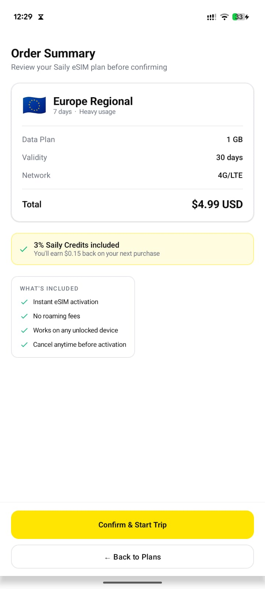
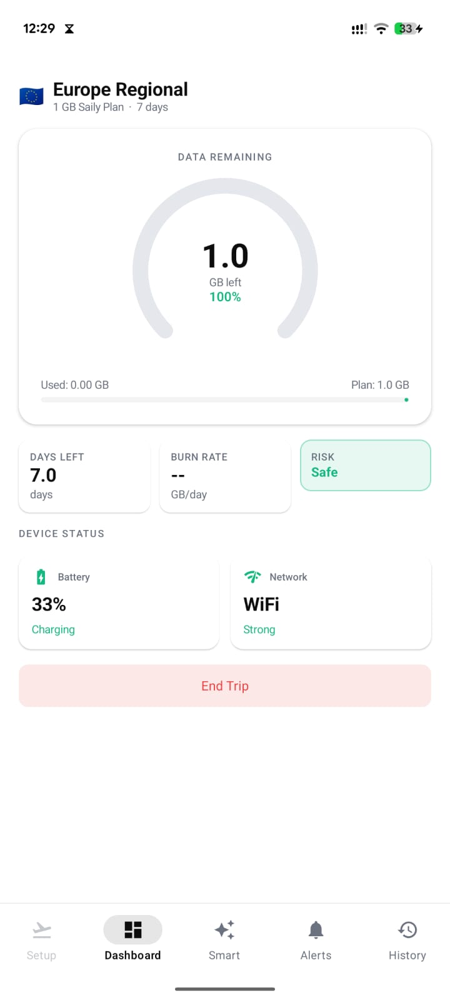
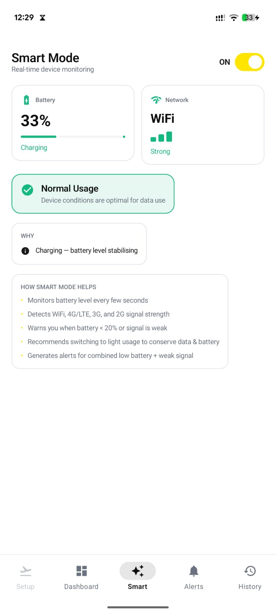
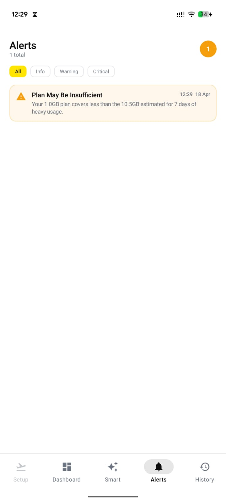
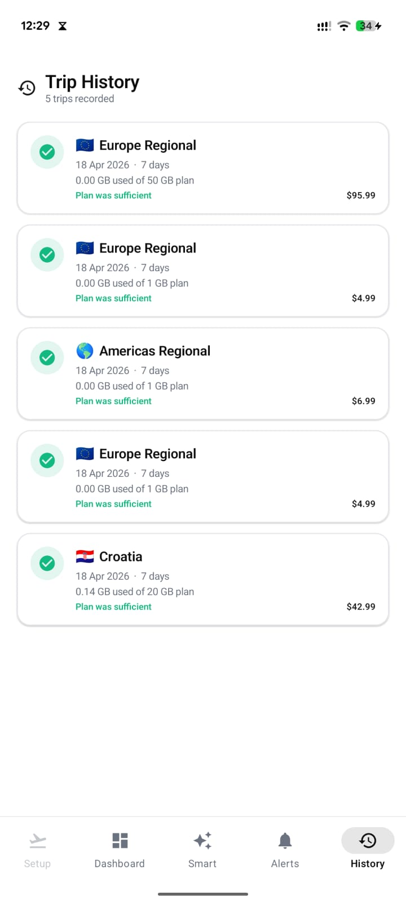

# ⛵ SailGuard

> **A smart travel eSIM companion app built for Saily — helping travelers choose the right data plan, track real usage, and protect their battery and signal on the go.**

[](https://kotlinlang.org)
[](https://developer.android.com)
[](https://developer.android.com/jetpack/compose)
[](https://developer.android.com/topic/architecture)


---

## 📱 Download

[**⬇️ Download APK**](https://drive.google.com/file/d/18LpOMDvChtRvyB1rHKfXdMPtNqn3qDIr/view?usp=sharing) · [**💻 View Source**](https://github.com/trinayanswarup/SailGuard)

> Requires Android 8.0 (Oreo) or higher. Enable "Install from unknown sources" in settings.

---

## 🎯 Why I Built This

Saily users frequently report two pain points: not knowing which data plan to buy before a trip, and running out of data mid-trip without warning. SailGuard solves both — before the trip with an AI-style plan recommendation engine, and during the trip with real-time device monitoring and smart alerts.

This app was built as a portfolio project for the Saily internship application, demonstrating product thinking, native Android development, and real device API integration.

---

## ✨ Features

### 🗺️ Smart Trip Setup (3-Step Wizard)
- Search 90+ countries or pick by region (Europe, Asia, Americas, Global)
- Set trip duration and usage style (Light / Medium / Heavy)
- Fine-tune usage with 5 sliders: Video Streaming, Maps, Video Calls, Social Media, Hotspot
- Real MB/hr rates based on actual Saily usage data

### 📊 Intelligent Plan Recommendation
- Blends slider estimates with historical trip data for accuracy
- Shows reasoning: *"Your 3 past trips averaged 0.8 GB/day + slider estimate = 1.2 GB/day blended"*
- Displays all available plans with real Saily-style pricing and "3% Saily Credits" badges
- Marks best value plan with "Best Choice" badge
- Supports Unlimited plans with selectable validity (7 / 15 / 30 / 90 days)
- Regional plans for Europe, Asia, Americas, and Global

### 🛒 Checkout Flow
- Order Summary screen before confirming
- Shows destination, plan size, validity, network type, total price
- "3% Saily Credits included" with cashback calculation
- What's Included checklist: instant activation, no roaming fees, cancel anytime

### 📡 Active Trip Dashboard
- Real-time data tracking using `TrafficStats.getMobileRxBytes()` + `getMobileTxBytes()`
- Animated ring gauge showing GB remaining (color shifts: green → yellow → red)
- Real battery % via Android `BatteryManager` API
- Real network type via `ConnectivityManager.NetworkCapabilities` (WiFi / 4G/LTE / 3G / 2G)
- Burn rate calculation and projected days remaining
- Risk levels: Safe (>50%) → Warning (25–50%) → Critical (<25%)
- End Trip with confirmation dialog

### ⚡ Smart Mode
- Monitors battery and network every few seconds in real time
- Triggers **Reduce Usage** recommendation when:
  - Battery drops below 20%, OR
  - Network degrades to 3G/2G
- Triggers **Critical** alert when both conditions hit simultaneously
- Toggle Smart Mode on/off
- Explains exactly *why* it's recommending a change

### 🔔 Alerts System
- Pace alert: *"At this pace your plan may run out in X days — Y days remain"*
- Weak signal detected alert
- 50% and 80% data usage milestones
- Filter by: All / Info / Warning / Critical
- Badge count on nav tab

### 📜 Trip History
- Saved to local Room database on device
- Shows destination flag, date, duration, GB used vs plan size, cost
- Green checkmark if plan was sufficient, red X if not
- Used by recommendation engine for future trips

---

## 🧠 How the Recommendation Engine Works

```
Step 1: Get slider daily estimate (GB/day from usage sliders)
Step 2: Get historical average (GB/day from past trips)
Step 3: If same destination visited before → weight 60% history, 40% slider
         If no same destination → weight 40% history, 60% slider  
         If no history at all → use slider only
Step 4: blended GB/day × trip days × 1.2 safety buffer = GB needed
Step 5: Pick cheapest plan that covers GB needed
```

---

## 🏗️ Architecture

```
com.sailguard.app/
├── data/
│   ├── model/          # SailyPlan, TripConfig, UsageStyle, Alert, DeviceStatus
│   ├── repository/     # PlanRepository (90+ countries), DeviceRepository (real APIs)
│   └── db/             # Room database, TripHistory entity, DAO
├── ui/
│   ├── screens/        # TripSetupScreen, UsageEstimatorScreen, DashboardScreen,
│   │                   # SmartModeScreen, AlertsScreen, CartScreen, HistoryScreen
│   ├── navigation/     # NavGraph, Screen sealed class, bottom nav
│   └── theme/          # Saily-inspired colors, typography, shapes
└── viewmodel/          # TripViewModel, UsageViewModel, DashboardViewModel,
                        # SmartModeViewModel — all activity-scoped with StateFlow
```

**Pattern:** MVVM with Unidirectional Data Flow  
**State management:** Kotlin `StateFlow` + `collectAsState()`  
**ViewModels:** Activity-scoped via `viewModels()` — survive tab switches  
**Database:** Room with KSP annotation processing  
**Real APIs used:**
- `BatteryManager` — battery level and charging status
- `ConnectivityManager.NetworkCapabilities` — network type detection
- `TrafficStats` — real mobile data bytes sent/received

---

## 🛠️ Tech Stack

| Layer | Technology |
|-------|-----------|
| Language | Kotlin 2.0.21 |
| UI | Jetpack Compose + Material 3 |
| Architecture | MVVM + StateFlow |
| Navigation | Navigation Compose |
| Database | Room + KSP |
| Build | Gradle with Kotlin DSL |
| Min SDK | API 26 (Android 8.0) |
| Target SDK | API 36 (Android 16) |

---

## 📸 Screenshots

| Setup | Usage | Plan Review |
|-------|-------|-------------|
|  |  |  |

| Order Summary | Dashboard | Smart Mode |
|--------------|-----------|------------|
|  |  |  |

| Alerts | History |
|--------|---------|
|  |  |

---

## 🚀 Getting Started

### Prerequisites
- Android Studio Panda or later
- Android SDK API 26+
- Kotlin 2.0.21+

### Installation

```bash
git clone https://github.com/trinayanswarup/SailGuard.git
cd SailGuard
```

Open in Android Studio, let Gradle sync, then run on a device or emulator.

---

## 🗺️ Plan Database Coverage

**90+ countries across 4 regions:**

- 🇪🇺 **Europe** — Lithuania, Germany, France, UK, Spain, Italy, Netherlands, and 30+ more
- 🌏 **Asia** — Japan, Thailand, South Korea, India, Singapore, Vietnam, and 20+ more  
- 🌎 **Americas** — USA, Canada, Mexico, Brazil, Argentina, and 15+ more
- 🌍 **Global** — 200+ destinations with regional coverage plans

**Plan tiers per region:**
- Fixed: 1GB, 3GB, 5GB, 10GB, 20GB, 50GB
- Unlimited: 7 / 15 / 30 / 90 day options
- Pricing scales by region (Lithuania → Europe → Global)

---

## 💡 Product Thinking

This app was designed to solve real Saily user pain points identified from app store reviews:

| Pain Point | SailGuard Solution |
|-----------|-------------------|
| "I didn't know which plan to buy" | 3-step wizard + blended recommendation engine |
| "I ran out of data with no warning" | Real-time burn rate + pace alerts |
| "The app drained my battery" | Smart Mode monitors battery and adjusts recommendations |
| "Signal was weak and data was slow" | Network quality detection + usage warnings |
| "I always overbuy data" | Historical trip data improves future recommendations |

---

## 👨‍💻 Built By

**Trinayan Swarup** 
Built with AI-assisted development (Claude Code) 
